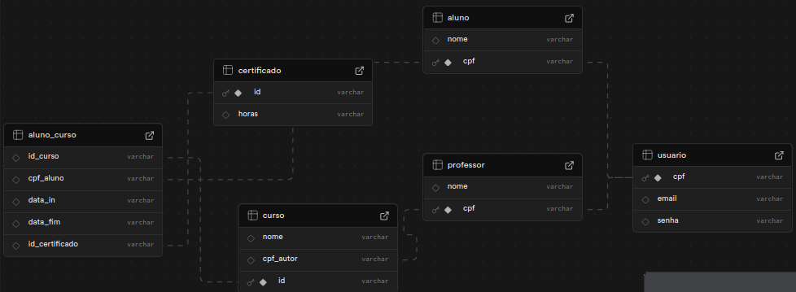
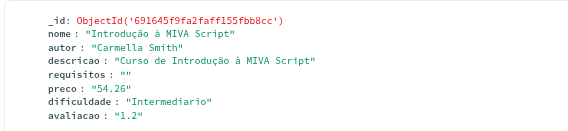
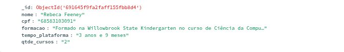
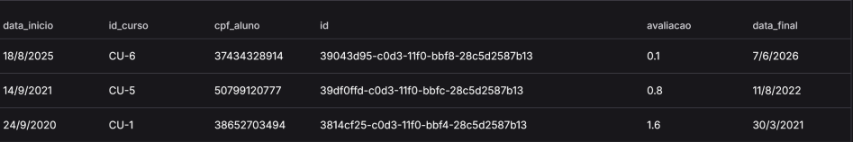

# LunarAcademy
## Tema: Plataforma online de cursos
O tema escolhido foi o de uma plataforma de cursos online. Nós escolhemos este tema para dar continuidade ao tema que foi escolhido pelo grupo para o desenvolvimento do projeto de Engenharia de Software no semestre anterior.
## Bancos de dados
Neste projeto, utilizamos três bancos de dados diferentes: Supabase, MongoDB e Cassandra. Escolhemos o primeiro por causa de dois semestres de experiências prévias(3° e 5° semestre), consequentemente o grupo sente mais facilidade em prosseguir o projeto com o PostgreSQL, utilizando a plataforma do Supabase, pois foi a plataforma com experiência mais recente. O MongoDB foi escolhido pois ele é um banco não estruturado e os dados que guardaremos podem alterar sem deixar de ser da mesma tabela. Utilizaremos para guardar as informações dos professores, por exemplo, não é necessário ter uma formação ou certificados, mas serão salvas se tiver. Outro exemplos, os cursos podem ou não ter pré-requisitos para ingressão. E por último, escolhemos o Cassandra pois ele é bom para guardar histórico, retorna mais rápido e mantém consistência porque quando algo é atualizado, o resto não é afetado. Assim, escolhemos o Cassandra para guardar  histórico de cursos feitos pelos alunos da plataforma.
## Implementação do S2
Cada banco tem certas tabelas dentro dele:
### Supabase
O banco do Supabase guarda as seguintes tabelas: 



#### curso
Onde são guardados todos os cursos cadastrados na plataforma. Nesta tabela, é guardado o nome do cursos, o autor e um ID para identificação.
#### usuario
Onde são guardados todos os usuários cadastrados na plataforma. Nesta tabela, são guardados o email,o CPF e a senha dos usuários. 
#### professor
Onde são guardadas todas as informações de todos os professores cadastrados na plataforma. É guardado apenas o nome e o CPF do professor.
#### aluno
Onde são guardadas todas as informações de todos os alunos cadastrados na plataforma. É guardado apenas o nome e o CPF do aluno.
#### certificado
Onde são guardadas as informações do certificado do aluno após o término do curso. Nela é guardado o id do certificado e o número de horas gastos no curso.
#### aluno_curso
Onde são guardadas as informações sobre o aluno de um certo curso. Contém o id do cursos, o cpf do aluno, as datas que o aluno começou e terminou o curso(data de término em branco se não tiver terminado) e o id do certificado de conclusão(se tiver um).

### MongoDB
#### cursos

Dentro desta tabela são guardadas mais informações sobre o curso, então além do nome, autor como no Supabase, aqui se encontram dados que possam ter alguma variância em suas entradas, como pré-requisitos, preço do curso, descrição e avaliação pelos usuários.
#### professores

Nesta tabela são guardadas mais informações sobre os professores dos cursos, então se tem o nome e CPF como no Supabase, porém também são inseridos dados sobre a formação do professor, a idade da sua conta na plataforma e a quantidade de cursos que ele publicou.

### Cassandra

#### historico
Dentro desta tabela contém todas as informações para formular um histórico para os alunos da plataforma. Ela contém o nome do aluno, o curso que foi concluido, as datas de início e fim do curso, além da avaliação dada pelo aluno.

## Como executar o projeto
### Pré-requisitos
Para executar o projeto, é necessário ter a linguagem Golang instalada na máquina, já que os códigos de geração e inserção de dados foram feitos completamente em Go.

### Compilação e execução do programa
Para o projeto ser executado, será necessário compilar o arquivo main.go com o seguinte comando:
```bash
go run main.go
```
O código será compilado e executado automaticamente após a compilação.

